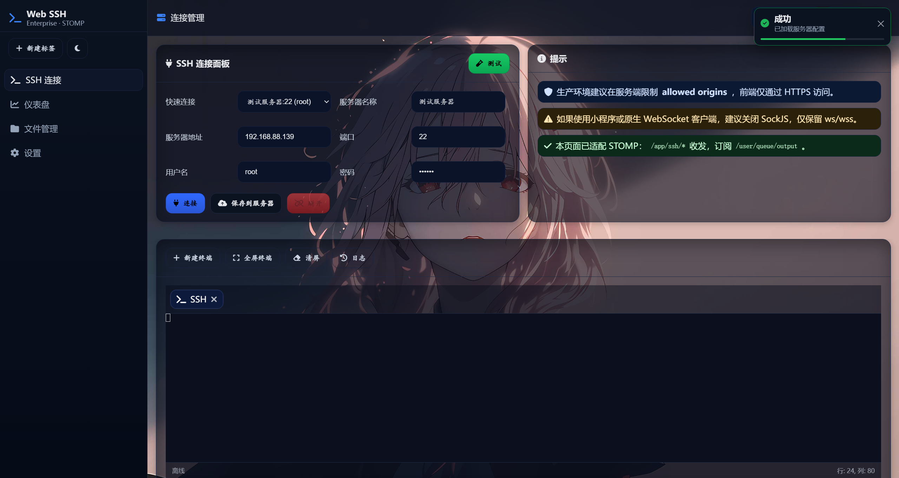
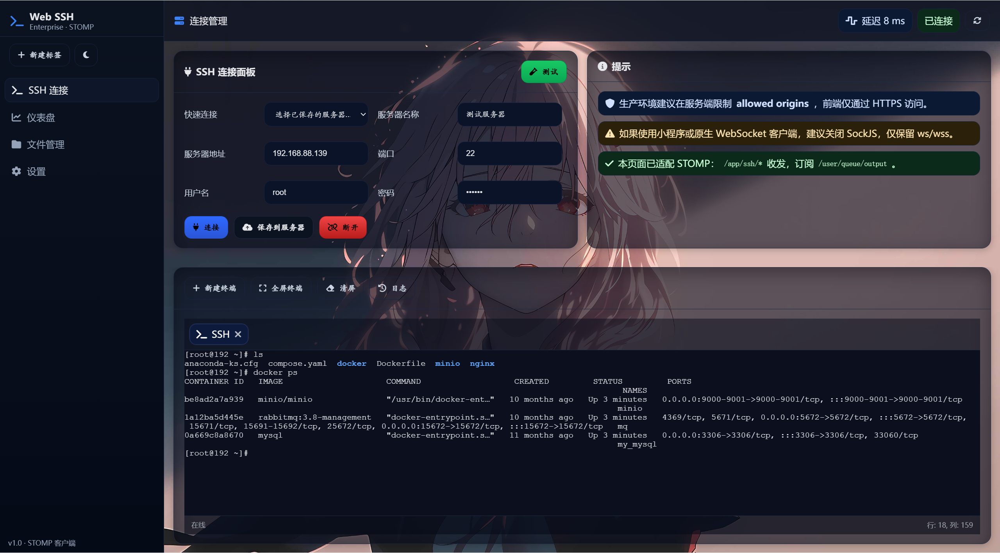
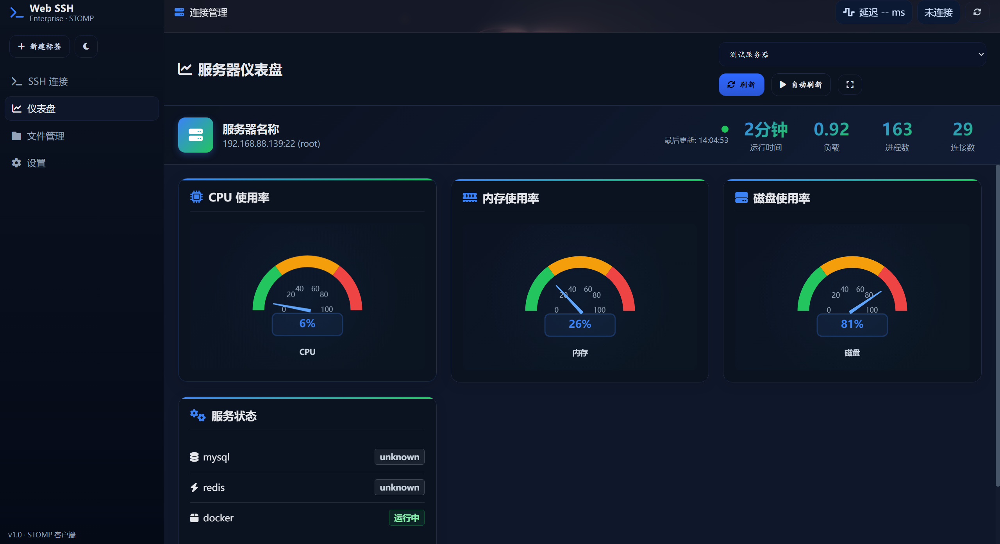
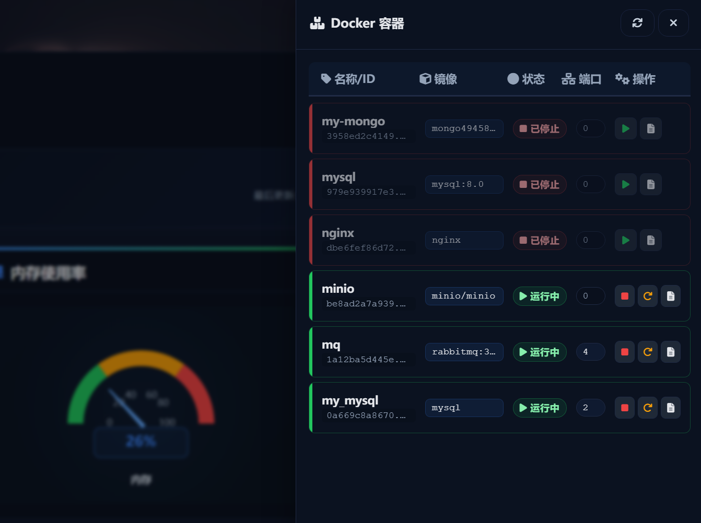
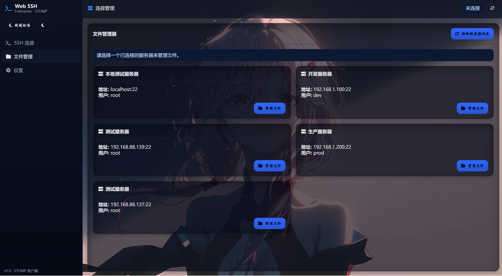
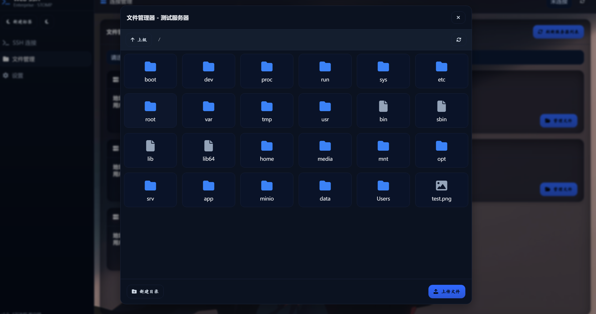
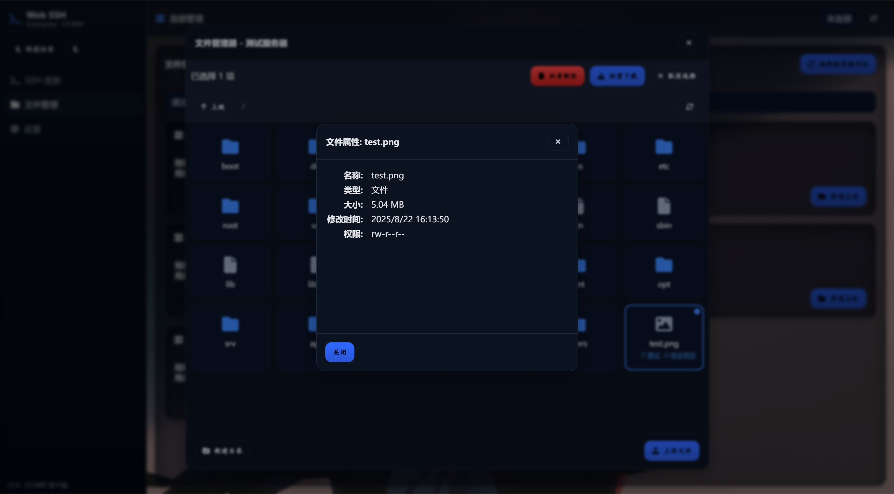
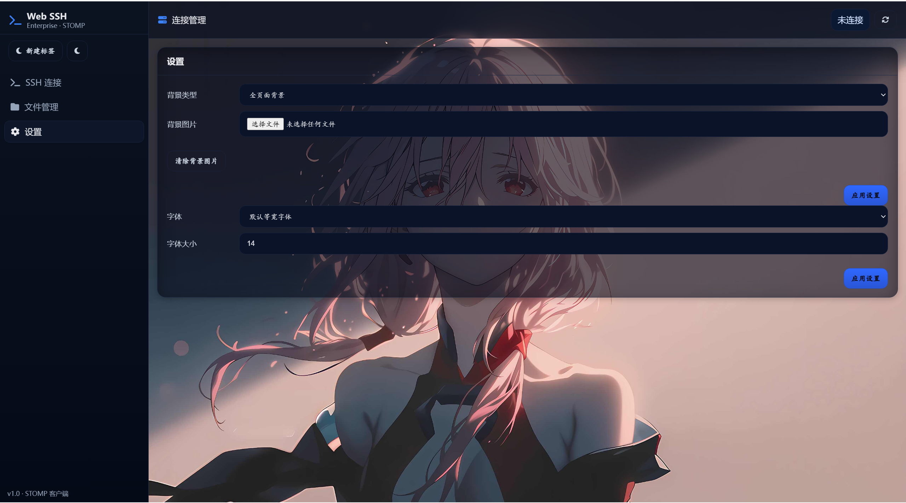

# Web SSH 网页版终端连接工具

[](https://github.com/Sqm-Zero)
[](https://github.com/Sqm-Zero)

## 项目简介

这是一个简单的Web SSH客户端，采用STOMP协议版本，允许用户通过浏览器直接连接和管理远程服务器。

## 开源社区

- **CSDN**: [沙琪马 CSDN](https://blog.csdn.net/iku_n?type=blog)
- **Github**: [沙琪马 Github](https://github.com/Sqm-Zero)


## 功能特点

- **远程SSH连接**：远程连接终端，支持远程SSH连接，测试连接判断远程服务器是否正常。
- **文件管理**：支持远程文件管理，支持上传、下载、删除、创建目录、重命名等功能。
- **自定义背景图片**：支持自定义终端背景图片。

## 技术栈

- **前端框架**：html、css、js
- **类型系统**：Java、springboot、websocket、STOMP、MySQL
- **本地存储**：localStorage

## 安装与使用

### 环境要求

- JDK 24
- SpringBoot3.5.4

### 获取代码

```bash
git clone https://github.com/Sqm-Zero/Web_SSH.git
cd web-ssh
```

### 运行项目

```
mvn clean install
```

## 展示效果

首页



仪表盘



文件管理



设置
